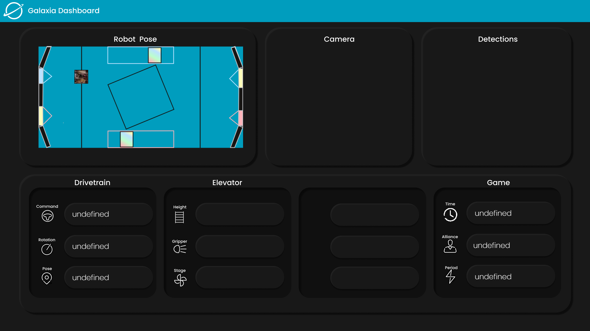

# Galaxia Dashboard



###### The Dashboard Displays:

- Robot Position Minimap,which in addition displays the rotation of the robot and autonomous paths.
- Driver Camera feed.
- Game Object and Target detections.
- Information of each part of a subsystem of the robot.
- FMS Information on the current state of the game.

to activate, run: ```py -3 -m pynetworktables2js --team 5987``` in the terminal.
